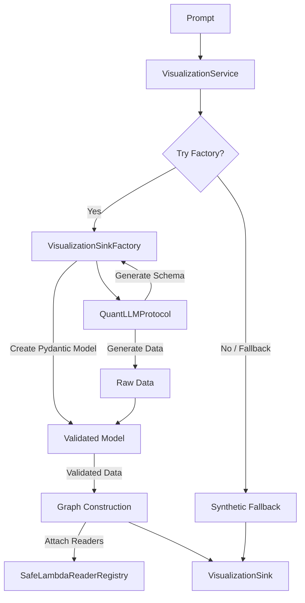

# Phase 2: Schema-Heavy Hybrid (Strategy B)

This document describes the Phase 2 architecture of the JOAT ACP Agent, focusing on dynamic model creation and lazy data handling.

## Overview

In Phase 2, we implement a hybrid approach that combines structured primitives with dynamic, LLM-driven schema validation. This allows the agent to handle a wide variety of financial insights without requiring a fixed schema for every possible data type.

### Key Components

1.  **`DataRef` Primitive**: An immutable reference to external data (e.g., a CSV file) that includes a path, a registered reader name, and optional parameters.
2.  **`VisualizationSinkFactory`**: A pure synchronous service that:
    - Calls a `QuantLLMProtocol` to generate a JSON Schema and corresponding data.
    - Dynamically creates Pydantic v2 models from the schema.
    - Validates the LLM-generated data against these models.
    - Maps the validated data to the core `VisualizationSink` structure.
3.  **`SafeLambdaReaderRegistry`**: A registry of pre-approved, safe data readers. This prevents uncontrolled code execution while allowing extensible data loading.
4.  **Jac Migration Path**: Throughout the Python implementation, `TODO (Jac)` blocks mark sections of logic that will be migrated to native Jac walkers and `by llm()` calls in Phase 3.

## Data Flow

1.  **Prompt**: User provides a prompt (e.g., "Analyze portfolio risk").
2.  **Factory Call**: `visualization_service` calls `VisualizationSinkFactory.create`.
3.  **Schema Generation**: LLM (via protocol) generates a JSON Schema for the expected insight.
4.  **Model Creation**: Factory uses `pydantic.create_model` to build a validator.
5.  **Data Generation**: LLM generates data matching the schema.
6.  **Validation**: Pydantic validates the data.
7.  **Reader Attachment**: If `DataRef` is detected in the data, the factory looks up the corresponding reader in the `SafeLambdaReaderRegistry` and attaches it (or its lazy result).
8.  **Sink Construction**: A fully immutable `VisualizationSink` is returned.

## Architecture Diagram (Mermaid)

## Jac TODO Migration Plan

- **Registry Lookup**: Replace `SafeLambdaReaderRegistry` with Jac node/edge properties or walker logic.
- **LLM Calls**: Replace Python protocol methods with `by llm()` calls inside Jac walkers.
- **Graph Building**: Replace Python dictionary mapping with native Jac node/edge creation.
- **Schema Management**: Use Jac's native type system and LLM integration for dynamic schema handling.
